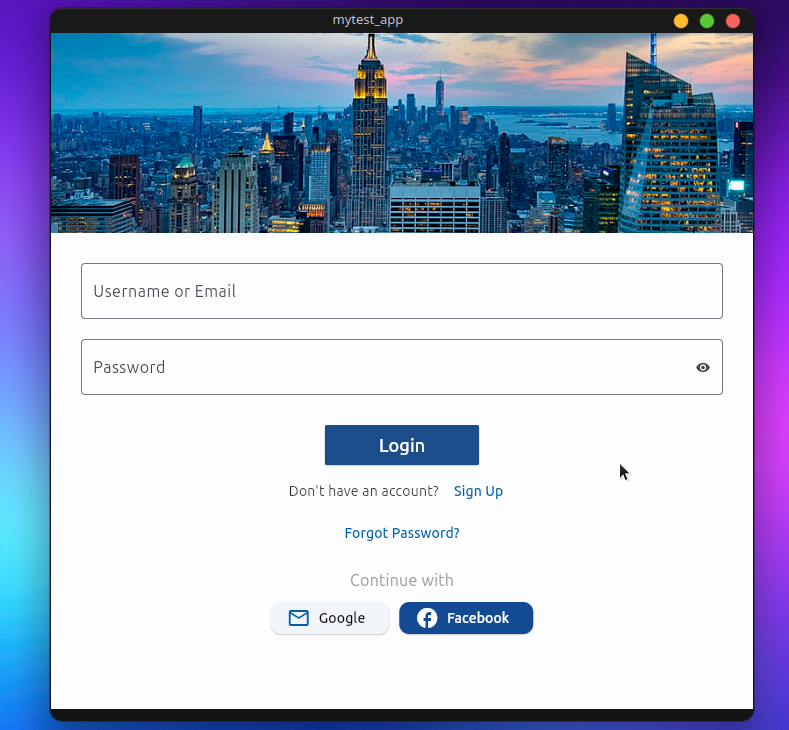

# Flutter Login

## Description
This is a simple Flutter application for user authentication, featuring a login page with various authentication options.

## App Features
- User-friendly login page.
- Password visibility toggle.
- Social media login options (Google, Facebook).

## How to Run
1. Clone the repository: `git clone https://github.com/soheil-vanaee/flutter-login.git`
2. Navigate to the project folder: `cd flutter-login`
3. Install dependencies: `flutter pub get`
4. Run the app: `flutter run`

## Screenshots
Include any additional screenshots or images here if needed.

## Author
- [soheil vanaee 💻](https://github.com/soheil-vanaee)

